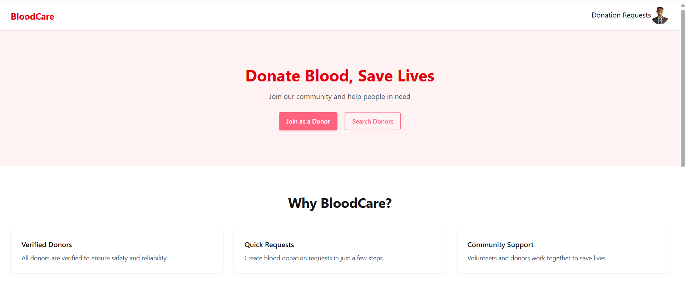

🩸 Blood Donation Management System – Frontend

This is the frontend of the Blood Donation Management System built using React.
The application allows donors, volunteers, and admins to manage blood donation requests efficiently through role-based dashboards.

🚀 Live Demo

live link: https://blooddonationhridoy.netlify.app/

backend : http://blooddonation-server-side-80.vercel.app

## 🖼 Screenshot

🛠️ Technologies Used

React (Vite)

React Router DOM

Axios

Firebase Authentication

Tailwind CSS

DaisyUI

SweetAlert2

JWT (via backend)

🔐 Authentication & Authorization

Firebase Authentication (Email/Password & Google)

JWT token issued from backend

Role-based protected routes:

Donor

Volunteer

Admin

📂 Project Structure
src/
│── api/
│   └── axiosSecure.js
│
│── components/
│── pages/
│   ├── Home/
│   ├── DonationRequests/
│   ├── Dashboard/
│   │   ├── Donor/
│   │   ├── Volunteer/
│   │   └── Admin/
│
│── providers/
│   └── AuthProvider.jsx
│
│── routes/
│   └── Router.jsx
│
│── data/
│   ├── districts.js
│   └── upazilas.js
│
│── main.jsx
│── App.jsx

🧑‍💻 User Roles & Features
👤 Donor

Dashboard Home with recent donation requests

Create donation request (only if active)

View, edit, delete own donation requests

Pagination & filtering

Donate funds

🧑‍⚕️ Volunteer

View all donation requests

Filter by donation status

Update donation status only (pending → inprogress → done/canceled)

View funding list

🛡️ Admin

Dashboard statistics (users, funding, requests)

Manage users (block/unblock, role change)

Manage all donation requests

Full access to funding data

📄 Pages & Routes
Public Routes
Route	Description
/	Home page
/donation-requests	Public donation requests (pagination ready)
/login	Login
/register	Register
Dashboard Routes (Protected)
Route	Role
/dashboard	Donor / Volunteer / Admin
/dashboard/my-donation-requests	Donor
/dashboard/create-donation-request	Donor
/dashboard/all-users	Admin
/dashboard/all-blood-donation-request	Admin / Volunteer
/dashboard/funding	Admin / Volunteer
⚙️ Environment Variables

Create a .env file in the frontend root:

VITE_API_BASE_URL=http://localhost:5000
VITE_FIREBASE_API_KEY=your_firebase_key
VITE_FIREBASE_AUTH_DOMAIN=your_domain
VITE_FIREBASE_PROJECT_ID=your_project_id
VITE_FIREBASE_STORAGE_BUCKET=your_bucket
VITE_FIREBASE_MESSAGING_SENDER_ID=your_sender_id
VITE_FIREBASE_APP_ID=your_app_id

⚠️ Never push .env to GitHub

▶️ How to Run Locally
# Clone repository
git clone https://github.com/readwanul390/blood-donation-frontend.git

# Go to project folder
cd blood-donation-frontend

# Install dependencies
npm install

# Start development server
npm run dev

🔗 Backend Repository

👉 (Add backend GitHub link here)
 [https://github.com/readwanul390/blood-donation-backend](https://github.com/readwanul390/blooddonation75-server-side)

📌 Key Features Implemented (Assignment Ready)

✅ Role-based dashboard

✅ JWT protected routes

✅ Pagination & filtering

✅ Admin / Volunteer permission control

✅ Blocked user restriction

✅ Secure API calls with Axios interceptor

## 📦 Dependencies
- react
- react-router-dom
- axios
- firebase
- sweetalert2
- jwt-decode
- tailwindcss
- daisyui

🧪 Notes for Examiner

Passwords & secrets are stored securely using environment variables

Pagination implemented on admin, donor & public pages

UI is fully responsive

Clean code & modular structure followed

📜 License

This project is developed for educational purposes.
